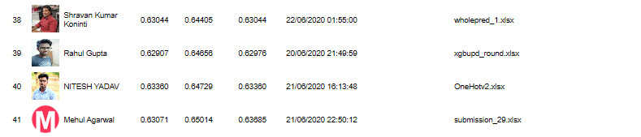

# ODI Match Winner : Weekend Hackathon #9

Our country shares a great deal of history with the game of Cricket. Introduced as a royal game by the British during the British Raj, India took on the game as a popular sport even after its Independence. Today Cricket is more than just a sport in India. In this hackathon, we challenge data science enthusiasts to predict the winning team of an ODI (One Day International) match.
Given are 10 distinguishing factors that can influence the outcome of a cricket match. Your objective as a data scientist is to build a machine learning model that can accurately predict the winning team of an ODI match

## Data Description:-
The unzipped folder will have the following files.
Train.csv –  2293 observations.
Test.csv –  983 observations.
Sample Submission – Sample format for the submission.
Target Variable: MatchWinner

## Evaluation: The leaderboard is evaluated using log_loss for the participant’s submission.

## Leaderboard rank: 39

## Online CV: 0.64656

## Local CV: 0.68
